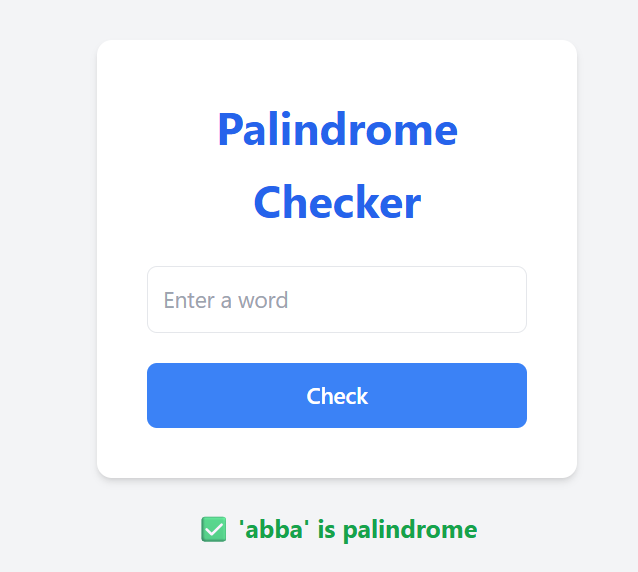

# Palindrome Checker

A simple **PHP web application** to check whether a given word is a palindrome. Built using **PHP** and **Tailwind CSS** for styling.

---

## 📝 Features

* Check if a word is a **palindrome**.
* **Responsive UI** using Tailwind CSS.
* Immediate result displayed below the input form.
* Clean and modern **design with large, readable fonts**.

---

## 💻 Demo



---

# 🔗 Live View

You can check out the live version of the app here:  
👉 [Palindrome Checker](https://php-palindrome-checker.onrender.com)

---

## 🚀 Getting Started

### Prerequisites

* PHP installed on your system (>=7.0 recommended)
* Web browser
* Local server (like XAMPP, WAMP, or Laragon)

### Installation

1. **Clone the repository**

```bash
git clone https://github.com/yourusername/palindrome-checker.git
```

2. **Navigate to the project directory**

```bash
cd palindrome-checker
```

3. **Start your local server** and open the project in your browser.

---

## 🛠 Usage

1. Enter a word in the input field.

2. Click the **Check** button.

3. The result will appear below the input:

   * ✅ Word is a palindrome
   * ❌ Word is not a palindrome

> Note: Only alphanumeric characters are considered; punctuation and spaces are ignored.

---

## ⚙️ How It Works

* The PHP function `isPalindrome()`:

  * Converts the input string to lowercase.
  * Removes all non-alphanumeric characters.
  * Compares the string to its reverse using `strrev()`.

* If the original string matches the reversed string, it’s a palindrome.

---

## 🎨 Styling

* **Tailwind CSS** used for modern and responsive styling.
* **Large fonts** for better readability (`text-xl` and `text-4xl` used in headings and results).
* Success messages in **green** and error messages in **red** for clarity.

---

## 📂 Project Structure

```
palindrome-checker/
├── index.php        # Main PHP file
├── README.md        # Project documentation
└── screenshot.png   # Optional screenshot
```

---

## ✨ License

This project is **open-source** and available under the [MIT License](LICENSE).
